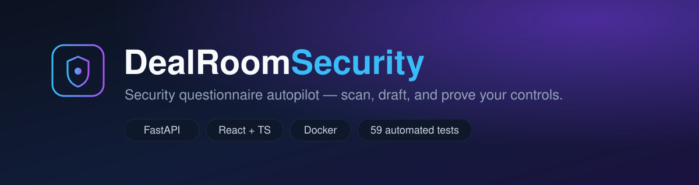
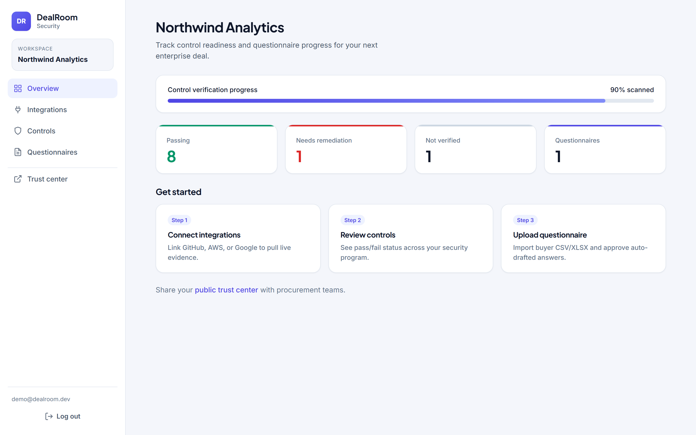
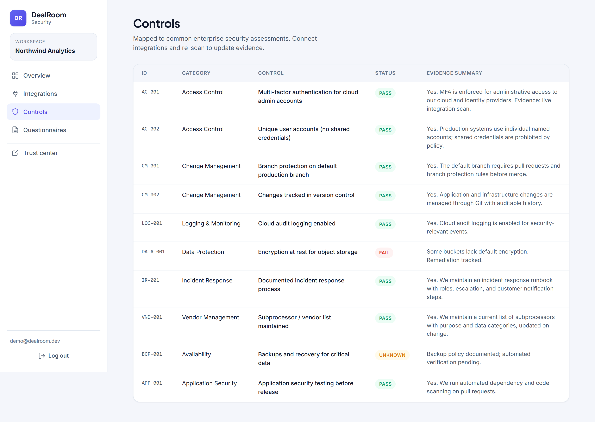
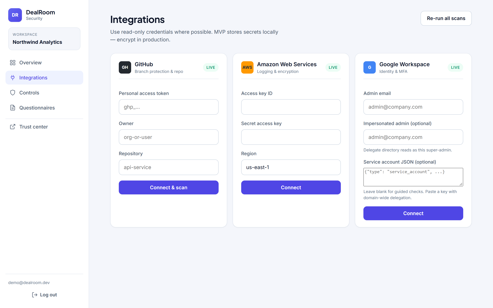
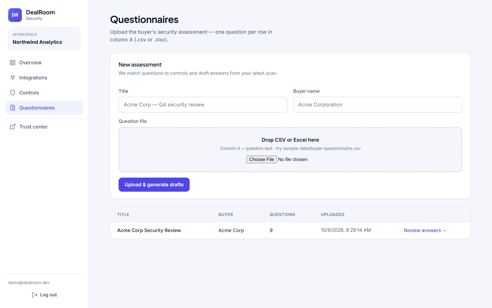
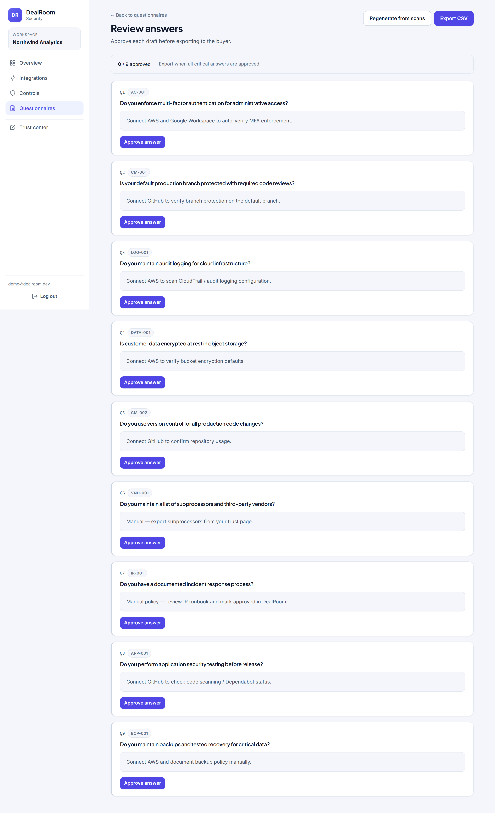
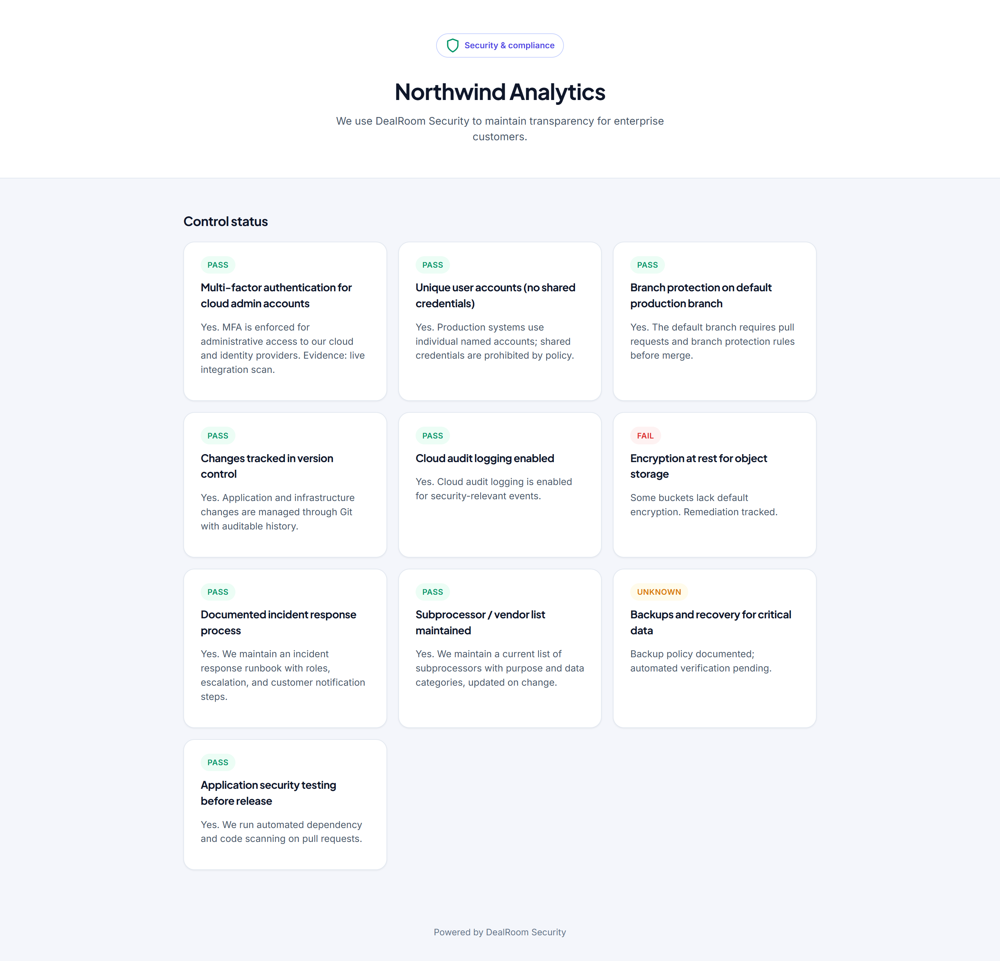
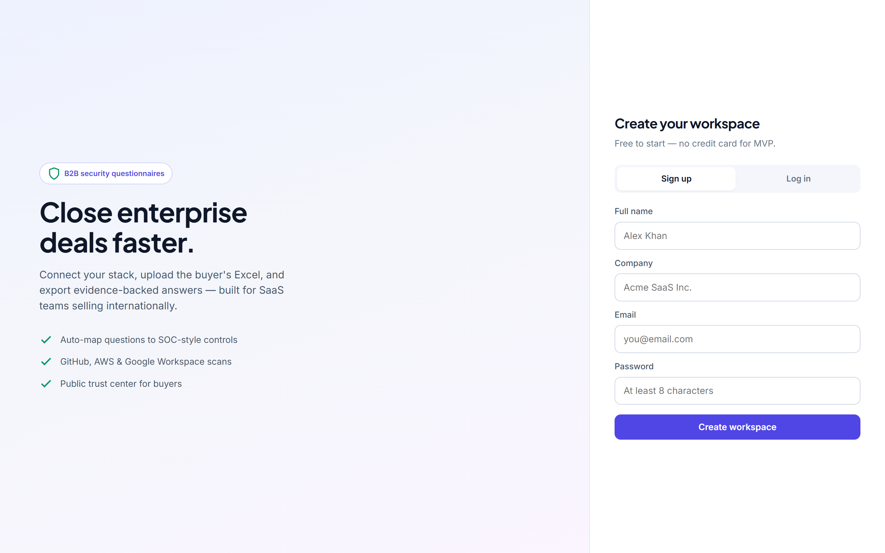
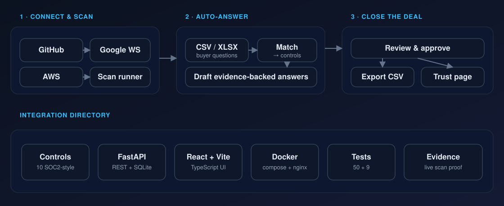

<div align="center">
  
</div>

<div align="center">

**Turn painful security questionnaires into minutes of work — scan real controls, auto-draft evidence-backed answers, and publish a public trust page.**


</div>

---

## What it does

B2B deals stall on security reviews. Buyers send 200-row spreadsheets, and teams spend days answering the same questions.

**DealRoom Security** connects to your real infrastructure, scans your controls, and turns a buyer's questionnaire into ready-to-review, evidence-backed answers.

- 🔌 **Connect GitHub, AWS, and Google Workspace** with read-only credentials
- 🛡️ **Scan real controls** — branch protection, MFA enforcement, audit logging, encryption, and more
- 📄 **Upload a buyer CSV/XLSX** → get matched, drafted answers
- ✅ **Review, approve, and export** in minutes instead of days
- 🌐 **Publish a public trust page** your prospects can visit anytime

## Screenshots

| Dashboard | Controls |
|:---:|:---:|
|  |  |

| Integrations | Questionnaires |
|:---:|:---:|
|  |  |

| Review &amp; approve drafts | Public trust page |
|:---:|:---:|
|  |  |

<details>
<summary>Sign in screen</summary>



</details>

## Architecture

<div align="center">
  
</div>

1. **Connect &amp; scan** — read-only integrations feed a scan runner that evaluates SOC2-style controls.
2. **Auto-answer** — a buyer's CSV/XLSX is parsed, questions are matched to controls, and drafts are generated from live evidence.
3. **Close the deal** — review and approve answers, export a CSV, and expose a public trust page.

## Stack

- **Backend:** FastAPI, SQLAlchemy, SQLite (dev), JWT auth
- **Frontend:** React + Vite + TypeScript
- **Integrations:** GitHub API, AWS (boto3), Google Workspace (Admin SDK via service account)
- **Ops:** Docker + docker-compose, nginx (serves the SPA and proxies `/api`)

## Run locally (Windows)

### Backend

```powershell
cd backend
python -m venv .venv
.\.venv\Scripts\Activate.ps1
pip install -r requirements.txt
uvicorn app.main:app --reload --app-dir .
```

API: http://127.0.0.1:8000 — docs at http://127.0.0.1:8000/docs

### Frontend

```powershell
cd frontend
npm install
npm run dev
```

App: http://localhost:5173

### Tests

```powershell
# backend
cd backend
pip install -r requirements-dev.txt
pytest

# frontend
cd frontend
npm test
```

Backend: auth (register/login/me), controls catalog, integrations + scan wiring (GitHub API mocked),
questionnaire upload / matching / approve / CSV export, org isolation, public trust page, and the
live Google Workspace Admin SDK path (mocked).
Frontend: API error formatting, auth form validation + token storage, questionnaire upload regression.

## Docker

Builds the API and serves the UI through nginx (which proxies `/api` to the backend):

```powershell
docker compose up --build
```

- App: http://localhost:8080
- API: http://localhost:8000
- SQLite data is kept in the `dealroom-data` volume.

## Deploy

The frontend is a static SPA and the backend is a long-running API — deploy them separately
(or use Docker on one host). A static host has no `/api` proxy, so the app **must** be told where
the backend lives, otherwise every `/api/...` call returns `404`.

### 1. Backend (Render, Railway, Fly.io …)

Deploy `backend/` using the included `Dockerfile`. Set these environment variables:

| Variable | Value |
| --- | --- |
| `SECRET_KEY` | a long random string (`openssl rand -hex 32`) |
| `DATABASE_URL` | `sqlite:///./dealroom.db` (or a Postgres URL for production) |
| `FRONTEND_URL` | your frontend origin, e.g. `https://dealroom-security.vercel.app` |

`FRONTEND_URL` accepts a comma-separated list, so you can allow several origins at once.

### 2. Frontend (Vercel / Netlify)

- **Root directory:** `frontend`
- **Build command:** `npm run build` → **Output:** `dist`
- **Environment variable:** `VITE_API_BASE=https://your-backend-host` (no trailing slash)

`frontend/vercel.json` (and `frontend/public/_redirects`) add the SPA rewrite so deep links like
`/controls` work on refresh. After setting `VITE_API_BASE`, redeploy the frontend.

## Demo flow

1. **Sign up** with a company name (creates the org + trust slug).
2. **Integrations** → connect GitHub (PAT with `repo` read) → branch protection & repo checks run.
3. **Controls** → review pass / fail / unknown.
4. **Questionnaires** → upload `sample-data/buyer-questionnaire.csv`.
5. **Review** → approve drafts → **Export CSV**.
6. Open the **Trust page** at `/trust/your-slug` (public).

### Integrations

- **GitHub:** personal access token (read). Scans branch protection, repo activity, and code scanning.
- **AWS:** access key + secret (read-only). Live checks when `boto3` is installed, guided otherwise.
- **Google Workspace:** paste an `admin_email` for guided checks, or a **service-account JSON**
  (with domain-wide delegation) plus the impersonated admin to run a live Admin SDK scan of
  admin 2-Step Verification enforcement and shared-mailbox usage.

## Project structure

```
backend/
  app/
    routers/          auth, org, controls, integrations, questionnaires, trust
    services/         scan_runner, answer_builder, question_matcher, integrations/*
    data/             control_catalog.py (10 SOC2-style controls)
    models/           SQLAlchemy entities
  tests/              50 pytest tests
frontend/
  src/
    pages/            Dashboard, Controls, Integrations, Questionnaires, Review, Trust
    api.ts            typed API client
    *.test.ts(x)      9 vitest tests
docs/
  assets/             banner + architecture (SVG)
  screenshots/        product screenshots
docker-compose.yml    backend + frontend (nginx)
sample-data/          buyer-questionnaire.csv
```

## Security note (MVP)

Integration secrets are stored in local SQLite as JSON. For production: encrypt at rest, use a
secrets manager, prefer OAuth over long-lived tokens, and move to PostgreSQL.

## Roadmap

- Stripe billing, team RBAC
- Questionnaire column mapping (multi-column Excel)
- PDF export + auditor pack
- Custom control library per framework (SIG Lite, CAIQ)
